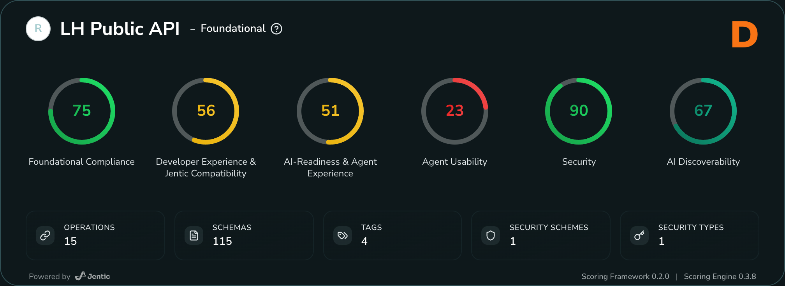

# Jentic API AI-Readiness Framework (JAIRF)

A syntactically valid OpenAPI description doesn't guarantee your API is ready for AI systems. Validity ensures conformance to the spec's grammar—but AI agents need APIs that express intent clearly and can be reasoned over safely by machines.

This repository contains the **Jentic API AI-Readiness Framework (JAIRF)**: a standards-aligned specification for evaluating how well APIs serve AI agents across six critical dimensions.

**What's included:**

- **Framework specification** defining evaluation criteria and scoring methodology
- **Reference scoring algorithms** for consistent, automated assessment
- **Guidance for implementers** to improve API AI-readiness

## The Six Dimensions

JAIRF evaluates APIs across these areas:

1. **Foundational Compliance** – Structural validity and standards conformance
2. **Developer Experience & Tooling Compatibility** – Documentation quality and tooling support
3. **AI-Readiness & Agent Experience** – Semantic clarity and context sufficiency for AI systems
4. **Agent Usability & Orchestration** – Safe, predictable multi-step operations
5. **Security & Governance** – Authentication, authorization, and trust mechanisms
6. **AI Discoverability** – How easily AI systems can find and understand your API

Small, targeted improvements in these areas produce outsized gains for both human developers and AI agents.

## Score Your APIs

See AI-readiness scoring in action at [jentic.com/scorecard](https://jentic.com/scorecard). Upload your OpenAPI specification and receive an instant assessment across all six dimensions.

Sample Top-level Scorecard:

## Publishing

Changes to `docs/specification/spec.md` on the `main` branch automatically publish to [jentic-docs](https://github.com/jentic/jentic-docs) via GitHub Actions. The workflow creates a PR with the updated specification.

You can view the published docs at [https://docs.jentic.com](https://docs.jentic.com/reference/api-readiness-framework/overview/).

## Maintainers

See [MAINTAINERS.md](./MAINTAINERS.md).

## Contributing

We welcome contributions from the community. See [CONTRIBUTING.md](CONTRIBUTING.md) for guidelines on reporting issues, submitting pull requests, and coding standards.

All contributors must follow our [Code of Conduct](CODE_OF_CONDUCT.md).

## Building Upon the Jentic API AI-Readiness Framework

If you build tools, extensions, or derived works based on this framework, please credit the Jentic API AI-Readiness Framework (JAIRF) and link back to this repository. This helps maintain the framework's visibility, accuracy, and supports the broader API and AI community.

The framework is licensed under [Apache License 2.0](LICENSE), which permits commercial and non-commercial use with proper attribution.

## License

This project is licensed under the [Apache License 2.0](LICENSE).
